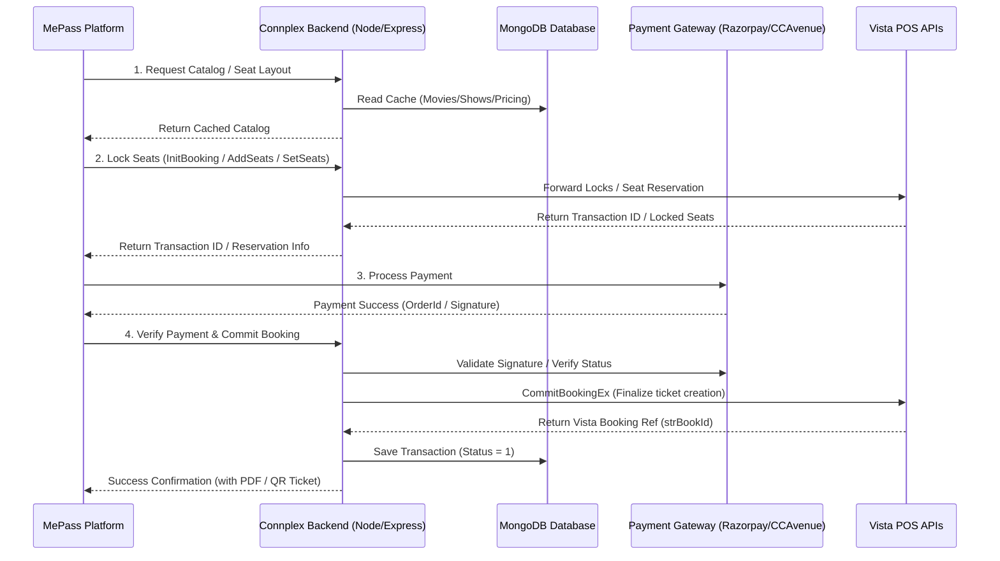

# Connplex Integration Questionnaire Response

This document provides technical answers to the integration questionnaire for connecting Connplex's movie ticket booking system with the MePass platform. Answers are compiled directly from the B2C backend codebase (`Node.js + Express + MongoDB`).

---

## 1. Integration Architecture

### Is your application integrated directly with Vista APIs, or is there an intermediate middleware/service between your application and Vista?
Yes. The Connplex backend acts as an intermediate API wrapper and middleware between the user-facing web/app interfaces and the Vista ticketing APIs. The backend makes direct HTTPS calls to Vista's SOAP/REST endpoints using `axios`.

### Will MePass integrate directly with Vista, or should all requests be routed through your backend APIs?
All requests should be routed through the Connplex backend APIs. The backend handles local database caching, JWT session management, payment authorization (Razorpay/CCAvenue), promotional coupon validation, loyalty coin/reward calculations, and database logging. 

### Do you provide dedicated APIs for third-party integrations?
Yes. The backend provides direct, database-free read routes specifically designed to expose raw, formatted Vista details for third-party consumers:
- `GET /api/vista-direct/movies` (Fetches movies directly from Vista)
- `GET /api/vista-direct/shows` (Fetches schedules directly from Vista)

### High-level architecture / flow diagram


---

## 2. Authentication & Security

### What authentication mechanism is used for your APIs?
- **JWT (JSON Web Token)**: Endpoints requiring user validation use the `auth` middleware, verifying the JWT sent via the `auth` header.
- **HMAC SHA-256**: Payment gateway signature verification is used for checking checkout requests.

### Code Reference: JWT Authentication (`Auth.js`)
```javascript
// File: src/middleware/Auth.js
import jwt from "jsonwebtoken";
import ResponseMessage from "../utils/ResponseMessage.js";

export const auth = async (req, res, next) => {
  const token = req.header("auth");
  if (!token) {
    res.status(401).json({
      status: 401,
      message: ResponseMessage.TOKEN_NOT_AUTHORIZED,
      data: [],
    });
  } else {
    try {
      const decode = jwt.verify(token, process.env.SECRET_KEY);
      if (decode.userId) {
        req.user = decode.userId;
        next();
      } else {
        res.status(400).json({
          status: 400,
          message: ResponseMessage.TOKEN_NOT_VALID,
          data: [],
        });
      }
    } catch (err) {
      if (err.name == "TokenExpiredError") {
        return res.status(401).json({ status: 401, message: err.message });
      } else {
        return res.status(500).json({ status: 500, message: err.message });
      }
    }
  }
};
```

### Will separate API credentials be provided for MePass?
Yes, dedicated JWT access tokens or custom partner API keys can be configured by generating custom credentials matching the `auth` middleware verification scheme.

### Are there any API rate limits?
Application-level rate limiting is not enforced within the Node.js/Express codebase itself. Rate limiting and IP restrictions are delegated to the deployment infrastructure layer (such as Nginx reverse-proxy rules or IIS `web.config` request filtering).

---

## 3. API Documentation
There are no Swagger or OpenAPI specifications configured directly in the codebase. All endpoints are mapped inside:
- `src/routes/UserRoute.js` (User profile, authenticated checkout)
- `src/routes/CommonRoutes.js` (Public catalog feeds, layout fetching, seat locking)

Detailed requests and responses for the core ticket workflow are documented below under **Section 8 (Booking Workflow)**.

---

## 4. Movie & Show Information

### Endpoints
1. **Get Movies (Regional Cache)**: `GET /api/get-movies-by-region/:regionId`
2. **Get Shows and Pricing**: `POST /api/movie-detils-with-shows`
3. **Get Showtimes by Cinema/Movie**: `POST /api/show-time-by-cinema-movie`
4. **Vista Direct Movies (Live Bypass)**: `GET /api/vista-direct/movies`
5. **Vista Direct Shows (Live Bypass)**: `GET /api/vista-direct/shows`

### Code Reference: Raw Vista Feed Fetching (`VistaDirectService.js`)
```javascript
// File: src/services/VistaDirectService.js
export const getMoviesByCinema = async () => {
  try {
    const response = await axios.request({
      method: "get",
      url: `${process.env.VISTA_URL}/api.asmx/GetAllDetails?test=string`,
    });
    // Processes FilmList and CinemaList ...
    return { success: true, data: response.data.data };
  } catch (error) {
    throw error;
  }
};
```

### How frequently is movie/show data updated?
Schedules are updated every **15 minutes** via an optimized cron job running on the server.
```javascript
// File: server.js
const optimizedSync = new CronJob('*/15 * * * *', async () => {
  console.log('Running cinema sync job...');
  try {
    await ensureIndexes();
    await syncAllCinema();
  } catch (error) {
    console.error('Cinema sync failed:', error);
  }
}, null, true, 'Asia/Kolkata');
```

### Should this data be cached, or always fetched live?
- **Cached**: General listings (movies, cinemas, show dates) should be queried from our local database cache for maximum speed.
- **Live**: Seat availability, seat coordinates layout, and specific session counts are fetched live from Vista to ensure real-time accuracy.

### How do we fetch currently running movies?
Query the Movie collection where `status` is active (`1`) and matches active sessions:
```javascript
const runningMovies = await Movie.find({
  status: 1,
  filmNowShowingFlag: "Y",
  deletedStatus: 0
});
```

---

## 5. Seat Layout & Availability

### Endpoint for fetching seat layout:
- **Endpoint**: `GET /api/seat-layout/:strCinemaId/:strSessId`
- **Vista API Called**: `/GetSeatLayout`

### Code Reference: Fetching Seat Layout (`Booking.js`)
```javascript
// File: src/controller/booking/Booking.js
export const getSeatLayout = async (req, res) => {
  try {
    let { strCinemaId, strSessId } = req.params;
    let config = {
      method: "get",
      url: `${process.env.VISTA_URL}/api.asmx/GetSeatLayout?strCinemaId=${strCinemaId}&strTransId=&strSessId=${strSessId}`,
    };
    axios.request(config)
      .then((response) => {
        if (response.data.data.length !== 0) {
          return res.status(200).json({ status: 200, data: response.data });
        } else {
          return res.status(400).json({ status: 400, message: "Error fetching layout" });
        }
      });
  } catch (error) {
    return handleErrorResponse(res, error);
  }
};
```

### Does the seat layout include metadata?
Yes, the raw payload returned from Vista `/GetSeatLayout` includes:
- **Seat Number** (Row/Column identification)
- **Seat Category / Area Code** (e.g. "VIP", "Executive")
- **Price** (Mapped to area category price tables)
- **Availability Status** (e.g. Sold, Blocked, Reserved)
- **Accessible / Wheelchair Seats**

### How should real-time seat availability be checked?
Checked live via `GetSeatLayout`. For list summaries, available seat totals are cached via `Session_AreaCount` sync in MongoDB.

---

## 6. Seat Reservation / Seat Lock

### Is there an API to temporarily reserve or lock seats?
Yes, locking is a multi-step workflow calling `/InitBooking`, `/AddSeats`, and `/SetSeats`.
1. **Initialize Session**: `GET /api/init-booking/:strCinemaId/:movieId`
2. **Reserve Capacity**: `POST /api/add-seats` (specifies seat category and quantity)
3. **Assign Coordinates**: `POST /api/set-seats` (coordinates mapped to the layout)

### Code Reference: Lock Reservation (`Booking.js`)
```javascript
// File: src/controller/booking/Booking.js

// 1. Initializing Vista session and local Transaction
export const initBooking = async (req, res) => {
  let { strCinemaId } = req.params;
  let config = {
    method: "get",
    url: `${process.env.VISTA_URL}/api.asmx/InitBooking?strCinemaId=${strCinemaId}`,
  };
  axios.request(config).then(async (response) => {
    if (response.data.Status == 1) {
      let transId = response.data.data;
      await new Transaction({ initTransId: transId }).save();
      return res.status(200).json({ status: 200, initTransId: transId });
    }
  });
};

// 2. Lock Seats in Vista
export const addSeats = async (req, res) => {
  let { id } = req.body; // CinemaId|strTransId|strSessId|strType|intQty
  const [cinemaId, strTransId, strSessId, strType, intQty] = id.split("|");
  let config = {
    method: "get",
    url: `${process.env.VISTA_URL}/api.asmx/AddSeats?CinemaId=${cinemaId}&strTransId=${strTransId}&strSessId=${strSessId}&strType=${strType}&intQty=${intQty}`,
  };
  axios.request(config).then((response) => {
    if (response.data.Status == 1) {
      return res.status(200).json({ status: 200, message: "Seats reserved temporarily" });
    }
  });
};
```

### How long does the seat reservation remain valid?
The reservation lock is configured for **10 minutes**.

### What happens when the reservation expires?
If a checkout request is made more than 10 minutes after initialization, the backend throws a `BOOKING_SESSION_EXPIRED` (400) error, prevents checkout, and clears the transaction.
```javascript
const initBookingTime = findTransaction.logs[0]?.initBooking;
if (initBookingTime && now.diff(moment(initBookingTime), "minutes") > 10) {
  return res.status(400).json({ message: "Booking session expired" });
}
```

### Can reserved seats be released manually?
Yes, by calling `GET /api/temp-cancel/:CinemaId/:strTransId` which hits Vista's `/CancelTrans` endpoint.

---

## 7. Pricing

### Which API provides ticket pricing?
Ticket pricing is queried from the local MongoDB collections `Price` and `PricePackage` (which sync from Vista `/GetAllDetails`). You can fetch it using `GET /api/price-details/:pGroupCode/:cinemaId`.

### Does the API return Base Price, Taxes, and Fees?
Yes:
- **Base Price**: `currentPrice`
- **Taxes**: `priceTax1`, `priceTax2`, `priceTax3`, `priceTax4`
- **Convenience Fee**: Mapped in the `Cinema` collection (`convenienceFees`)

### Code Reference: Price Scheme
```json
{
  "cinemaId": "CN01",
  "pGroupCode": "ADULT",
  "tTypeCode": "STD",
  "areaCatCode": "SOFA",
  "currentPrice": 250.00,
  "priceTax1": 22.50,
  "priceTax2": 22.50
}
```

### Is pricing calculated by Vista or by your application?
Vista calculates all pricing structures. The local application stores the sync configurations and applies local loyalty point adjustments or coupons on top of the base totals.

---

## 8. Booking Workflow

Below is the sequence of endpoints to complete a booking:

| Step | Action | Endpoint | Method | Payload / Query |
|------|--------|----------|--------|-----------------|
| 1 | Find Movies | `/api/get-movies-by-region/:regionId` | `GET` | |
| 2 | Find Sessions | `/api/movie-detils-with-shows` | `POST` | `{ id: "regionId\|date\|movieId" }` |
| 3 | Fetch Layout | `/api/seat-layout/:strCinemaId/:strSessId` | `GET` | |
| 4 | Init Trans | `/api/init-booking/:strCinemaId/:movieId` | `GET` | |
| 5 | Reserve Qty | `/api/add-seats` | `POST` | `{ id: "CinemaId\|transId\|sessId\|type\|qty", showId }` |
| 6 | Select Seats | `/api/set-seats` | `POST` | `{ cinemaId, strTransId, lngSessionId, strSelectedSeats, ... }` |
| 7 | Payment Request| `/api/user/ccavRequestHandler` | `POST` | `{ id: "<AES-encrypted payload containing transId and details>" }` |
| 8 | Complete Booking| `/api/user/ccavResponseHandler` | `POST` | `{ paymentStatus, razorpay_payment_id, razorpay_signature, transId, ... }` |

### Code Reference: Direct Booking commits (`RazorpayResponseHandler.js`)
If the final transaction amount is zero (redeemed entirely via coupon/points), the system bypasses payment and commits directly:
```javascript
// File: src/services/razorpay/RazorpayResponseHandler.js
export const razorpayBookDirectly = async (res, userId, transId, cinemaId, sessionId) => {
  const commitUrl = `${process.env.VISTA_URL_BOOKING_URL}/CommitBookingEx?strCinemaId=${cinemaId}&strTransId=${transId}&lngSessId=${sessionId}`;
  const response = await axios.get(commitUrl);
  if (response.data.Status === 1) {
    return res.status(200).json({ success: true, message: "Booking Committed successfully" });
  }
};
```

---

## 9. Payment Integration

### Who processes the payment?
The **Connplex Backend** processes the payment using Razorpay or CCAvenue (switched via environmental properties).

### If MePass processes the payment, how should the booking be confirmed in Vista?
MePass should securely invoke Connplex's payment verification endpoint or a custom partner endpoint passing the external payment ID, and the Connplex backend will execute `CommitBookingEx` to finalize the ticket inside Vista.

### What happens if payment succeeds but booking confirmation fails?
If `VISTA_TICKET_REFUND === "true"`, the backend catches the Vista failure and triggers an **automatic refund** via the gateway SDK, updating the transaction status to `3` (Auto-refunded).

### Code Reference: Vista Commit & Auto-Refund Flow
```javascript
// File: src/services/razorpay/RazorpayResponseHandler.js
axios.get(commitBookingExUrl)
  .then(async (vistaResponse) => {
    if (vistaResponse.data.Status == 1) {
      // 1. Success path
      await _handleBookingSuccess(transId, vistaResponse.data.data);
      return res.status(200).json({ redirectUrl: "/confirmation-screen" });
    } else {
      // 2. Failure path - auto-refund if enabled
      if (process.env.VISTA_TICKET_REFUND === "true") {
        await refundRazorpay(paymentId, amount);
        await _handleTicketFailed(transId, "Refunded due to Vista error");
      }
      return res.status(400).json({ redirectUrl: "/transaction-failed" });
    }
  });
```

---

## 10. Booking Management

### APIs:
- **Get Booking Details**: `POST /api/booking-details-by-transid` (takes `initTransId`) or `GET /api/transaction-details/:transId`
- **Booking History**: `GET /api/user/my-booking`
- **Cancel Booking**: `GET /api/ticket-cancel/:CinemaId/:strTransId`

### Is partial cancellation or rescheduling supported?
No. Partial cancellation and rescheduling are not supported by the current API setup; a ticket must be canceled fully and re-booked.

---

## 11. Ticket Generation
Tickets are generated on-the-fly as a PDF document containing a **QR Code**. The QR Code encodes the Vista booking identifier (`strBookId`).
- **PDF URL**: `/api/download-ticket-pdf/:initTransId/ticket.pdf`
- **QR Generation Code**:
  ```javascript
  // File: src/utils/Mailers.js
  let QRCodeTicket = await QRCode.toDataURL(`${data?.addSeatData?.strBookId}`);
  ```

---

## 12. Customer Information

### What customer information is mandatory for booking?
- Customer Name
- Customer Mobile Number (used for sending SMS and tickets)

### Is guest booking supported?
No. User authentication is mandatory. The API expects a valid `userId` associated with a verified account:
```javascript
const user = await User.findOne({ _id: initBookingDetails.userId._id });
```
Users verify their identity via mobile/email OTP before checking out.

---

## 13. Food & Beverage (Optional)

### Does Vista support food and beverage booking?
Yes, concessions can be fetched and added directly to the Vista transaction.

### Can we fetch food menus?
Yes, using `GET /api/item-details-by-cinema/:id` (queries concessions synced from Vista `/GetAllItems`).

### Can food be added during ticket booking?
Yes, using `POST /api/add-conssesion`.
- **Vista API Called**: `/AddMultiConcessionsNew`
- **Request Parameters**: `strCinemaId`, `strTransId`, `strItemsOrder` (XML formatting of item IDs and quantities).

### Code Reference: Adding Concessions (`FoodAndBvg.js`)
```javascript
// File: src/controller/booking/FoodAndBvg.js
export const addConcessions = async (req, res) => {
  let { cinemaId, strTransId, strItemsOrder, itemData } = req.body;
  let config = {
    method: "get",
    url: `${process.env.VISTA_URL}/api.asmx/AddMultiConcessionsNew?strCinemaId=${cinemaId}&strTransId=${strTransId}&strItemsOrder=${strItemsOrder}`,
  };
  axios.request(config).then(async (response) => {
    if (response.data.Status == 1) {
      await Transaction.findOneAndUpdate({ initTransId: strTransId }, { $set: { fAndBDetails: itemData } });
      return res.status(200).json({ status: 200, message: "Concessions added" });
    }
  });
};
```

---

## 14. Webhooks
The backend does not currently support outbound webhooks to third-party partners. It only receives inbound webhooks from Razorpay (`POST /api/user/razorpay-webhook`) to track asynchronous transaction confirmations.

---

## 15. Error Handling

### Standard Response Messages (`ResponseMessage.js`)
The application defines standard response strings for validation failures:
- `BOOKING_SESSION_EXPIRED`: "Booking session expired."
- `MOVIE_NO_LONGER_AVAILABLE`: "This movie is no longer showing."
- `SHOW_NOT_AVAILABLE`: "The selected show is unavailable."
- `BOOKING_DETAILS_MISMATCH`: "Verification failed, seat quantity or amount mismatch."

### Vista Errors
Soap exception messages from Vista are logged into `VistaLog` and mapped to a standard API 400 response. If a transaction fails mid-commit, the auto-refund system is triggered.

---

## 16. Data Synchronization
Catalog synchronization is handled by scheduling background batch updates to Vista's SOAP API:
- **Process**: Cron runs every 15 minutes, calls `/GetAllDetails` and `/GetAllSession`.
- **Removal/Cancellation**: Shows not present in the new feed are flagged as `isActive = false` or marked with screen status `"C"` (Cancelled).
- **Integration recommendation**: MePass should poll the Connplex database cache instead of hitting Vista directly, maintaining high performance and avoiding rate limiting on Vista services.

---

## 17. Sandbox / Testing Environment
- **Staging API Endpoint**: Configured in `.env` via `VISTA_URL`
- **Payment Mocking**: Enabled by setting `RAZORPAY_PAYMENT_MODE="test"`. This charges ₹1 per transaction and does not execute real bank transfers.

---

## 18. Production Environment
- **Base URL**: Set to Connplex API servers (e.g. `https://ticketing.theconnplex.com`)
- **Credentials**: Managed via environment parameters.
- **Go-Live Switch**: Set `RAZORPAY_PAYMENT_MODE="production"` and `VISTA_TICKET_BOOKING="true"`.

---

## 19. Performance & Uptime
- **Cached Catalog endpoints**: Response times < 100ms.
- **Transactional flows (Seat lock/commit)**: Response times depend on Vista POS host connection latency (typically 1.5 - 3 seconds).

---

## 20. Support & Communication
- **Escalation Contacts**: Managed by B2B operations. Notification templates are configured to email `it@theconnplex.com` and `finance@theconnplex.com` on failures.

---

## 21. Additional Technical Clarifications

### Does your backend perform business logic before Vista communication?
Yes:
- Enforces the **10-minute session expiration** window.
- Validates the local calculation of ticket convenience fees and taxes against the synced price sheet.
- Redeems coupons/vouchers and verifies loyalty coins balance, discounting the final payment amount down to 0 if applicable.

### Local Cache database details
The MongoDB database retains:
- **Cinemas**: `Cinema`
- **Movies**: `Movie`
- **Shows**: `Show` (SessId, Screen Name, Layout ID)
- **Pricing**: `Price`, `PricePackage`
- **Concessions**: `Item` (Beverage, Popcorn, Combo, Snacks menu)
- **Bookings**: `Transaction` (Keeps track of local status and payment responses)

### Known limitations
- Seat locks expire exactly 10 minutes from Vista session creation.
- Booking commits are non-reversible without executing a full cancellation.
- If payment gateways report asynchronous delays, background Cron jobs reconcile pending status counts to avoid mismatching Vista bookings.
